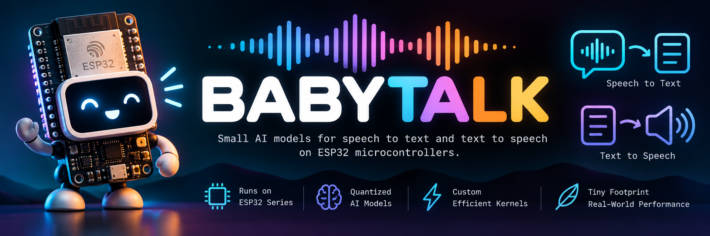

# BabyTalk



**BabyTalk** is a software library that lets an ESP32-S3 or ESP32-P4 **understand what you
say and talk back, with no cloud and no internet**, from C, MicroPython, or Erlang/Elixir on
AtomVM:

```python
import stt, tts
text = stt.transcribe(pcm)                 # 16 kHz audio -> "what's the weather like today"
audio = tts.say("You said: " + text)       # text -> 24 kHz audio for the speaker
# lcd.text(text, 0, 0)                     # or send the text anywhere: a screen, LoRa, MQTT...
```

**Memory, bottom line:** speech to text needs **6 MB of flash** and **84.5 KB of internal
RAM**; text to speech adds **1.9 MB of flash**. Each borrows a few hundred KB of **PSRAM**
while it works.

| | flash | PSRAM | internal RAM |
|---|---|---|---|
| **Speech to text** (4-bit model) | 6.0 MB: the model, read in place | 0.2 MB, transcribing 4 s (more for longer clips) | 84.5 KB, shared with text to speech |
| **Text to speech** (nano voice) | 1.9 MB: voice 0.34 MB, pronunciations 1.5 MB | 0.5 MB, a 4 s reply | the same 84.5 KB |

- The speech model is **never copied into RAM**: the chip reads it from flash as it runs.
- The two take turns with one 84.5 KB block of internal RAM, and that block can live in
  PSRAM instead (a little slower). Under MicroPython, text to speech also keeps 104 KB of
  buffers in internal RAM; the AtomVM firmware puts them in PSRAM.
- Bigger and better: the 8-bit speech model (9.8 MB of flash, more accurate), and on the
  ESP32-P4 the much better-sounding `heart` voice (2.4 MB of flash, loaded into PSRAM).
  Every option: [Models](#models). The full breakdown: [Performance and memory](#performance-and-memory).

Made by Thomas Lackner and Claude Opus 5.5 (Anthropic). MIT licensed; the speech models
belong to their authors (see [Credits and licenses](#credits-and-licenses)).

## Is this for you?

Most "voice on ESP32" projects do one of two things:

- **send the audio to a cloud service** (Whisper API, Google, wit.ai) and wait for text, or
- **recognize a fixed list of commands or wake words** that were trained in advance
  (e.g. ESP-SR's MultiNet, Edge Impulse / TensorFlow Lite Micro keyword spotting).

BabyTalk is different: a **general-purpose English speech recognizer** that runs
entirely on the chip. It transcribes *any* sentence, with no training and no command list.
A wake phrase is any phrase you type ("wake up, tomato face"), also with no training.
Optionally the same firmware **speaks** replies with an on-device neural voice.

You'll want it if you need voice input that keeps working offline, keeps audio private, or
can't depend on a server. For example:

- **Radios without keyboards.** A LoRa node (Meshtastic, or your own protocol) with a
  microphone but no keyboard: speak a message, and the node sends it as text. A spoken
  sentence becomes a few dozen bytes of text; even a very low-bitrate voice codec (Codec2
  at 700 bit/s) needs about ten times that, which matters on a link that moves a few
  hundred bytes per second at best.
- **Speakers without screens.** The receiving node reads incoming text messages aloud.
- **Voice control that works when the WiFi doesn't**, and never sends audio anywhere.

Skip it if you need very high accuracy, languages other than English, or it has to run on
a smaller chip (see below).

(This may also be the only project that involves both **LoRa** radios and **LoRA**,
Low-Rank Adaptation. The original research plan in `docs/historical/` explored LoRA-style
expert adapters for the speech model. They aren't used yet.)

## What you need

- **An ESP32-S3 or ESP32-P4** with 16 MB flash and 8 MB PSRAM (e.g. an S3 "N16R8" module).
  The P4 transcribes about 1.7 times faster (2 s of speech in 0.30 s, against 0.51 s) and
  can run a larger, better-sounding voice. BabyTalk runs on:
  - **Waveshare ESP32-S3-CAM** (ES7210 mic, ES8311 speaker codec): the reference board;
    everything is measured on it, from MicroPython and AtomVM
    ([docs/BOARD_WAVESHARE_S3_CAM.md](docs/BOARD_WAVESHARE_S3_CAM.md))
  - **Waveshare ESP32-P4-WIFI6** (ES8311 mic and speaker codec), from AtomVM
    ([docs/BOARD_WAVESHARE_P4_WIFI6.md](docs/BOARD_WAVESHARE_P4_WIFI6.md))
  - **LilyGO T-LoRa Pager** (ES8311), from AtomVM, with its own audio driver
  - **Elecrow CrowPanel Advance 7.0"** (PDM mic), from AtomVM, speech to text only
- **A microphone**, for speech to text: anything that gives 16 kHz PCM.
- **A speaker**, for text to speech (optional).
- **To build:** Linux or WSL, [ESP-IDF v5.5.1](https://docs.espressif.com/projects/esp-idf/en/v5.5.1/esp32s3/get-started/),
  and [uv](https://docs.astral.sh/uv/) for the Python tools. (AtomVM also needs
  Erlang/OTP 26+ and Elixir 1.17+.)

## Models

### Speech to text

NVIDIA's [Citrinet-256](https://huggingface.co/nvidia/stt_en_citrinet_256_ls), compressed
to 4 or 8 bits, in two versions: the original, and one fine-tuned for background noise.
All four are ready to flash from [`models/`](models/) (SHA-256, licence and how each was made:
[`models/README.md`](models/README.md)).

| file | flash | noisy rooms* | clean speech** | fits |
|---|---|---|---|---|
| **`citrinet256_int4.mmrt`** (default) | **6.0 MB** | 58.1% | **8.2%** | the standard 6 MB model partition |
| `citrinet256_int8.mmrt` | 9.8 MB | 51.5% | 6.3% | a 10 MB model partition |
| `citrinet256_noisy_int4.mmrt` | 6.0 MB | 42.7% | 11.8% | the standard 6 MB model partition |
| `citrinet256_noisy_int8.mmrt` | 9.8 MB | **33.8%** | 7.8% | a 10 MB model partition |

Word error rate, lower is better. \*82 recordings made on the boards with music, highway
noise or a coffee-shop loop in the background (see [Training for the real
world](#training-for-the-real-world-work-in-progress)). \*\*LibriSpeech test-clean (clean,
read English); the original full-precision model scores 3.8%.

**The `noisy` models are an alternative, not an upgrade:** a quarter to a third fewer words
wrong with noise in the room, more wrong on clean speech. Pick by where the board will
listen. They are the same size as the originals, and need no firmware or code change: the
file records its own format.

Wake phrases need no model of their own: the speech model's output is scored against the
phrase.

### Text to speech

| voice | flash | PSRAM | sounds* | runs on |
|---|---|---|---|---|
| **`nano`** (default), 294k parameters | 1.9 MB with the pronunciation dictionary | 0.5 MB | 2.13 | every board, compiled into the firmware |
| **`heart`**, 2.27M parameters | 2.4 MB more, in its own partition | 2.4 MB more | **3.36** | ESP32-P4 only, at half real time |

\*SCOREQ, a predicted listener rating (higher is better). Both are
[sanoTTS](https://github.com/Ampixa/sanoTTS) voices; details and the 4-bit `heart4`:
[`docs/TTS_VOICES.md`](docs/TTS_VOICES.md).

**Building your own** (fine-tuning on your recordings, other languages, other voices):
[`docs/MODELS.md`](docs/MODELS.md).

## Quick start

All three ways in share one engine (`components/`) and give the same transcripts.

### MicroPython (ESP32-S3)

A MicroPython v1.27.0 firmware with `stt` and `tts` modules. You bring the audio with
`machine.I2S`; codec drivers for the ES7210 and ES8311 are in `mpy/drivers/`. Transcription
can run in the background while asyncio keeps going, and a wake phrase is a list of
spellings. Full API: [`mpy/README.md`](mpy/README.md).

```python
import stt
stt.phrase(["wake up tomato face"])        # score every run for this phrase
text = stt.transcribe(pcm)
stt.last()["score"]                        # 0 = the phrase is the best reading
```

**1. Build the firmware** (MicroPython v1.27.0 with a small patch that lets `machine.I2S`
drive the codec's master clock):

```bash
REPO=$PWD                                   # this repository
. ~/esp/esp-idf/export.sh                   # wherever your ESP-IDF v5.5.1 lives
mkdir -p ~/build/sentry-fw && cd ~/build/sentry-fw
git clone --depth 1 -b v1.27.0 https://github.com/micropython/micropython
git -C micropython apply $REPO/mpy/patches/micropython-i2s-mck.patch
make -C micropython/ports/esp32 submodules
git clone https://github.com/Ampixa/sanoTTS ~/build/tts/sanoTTS             # optional: text to speech,
git -C ~/build/tts/sanoTTS checkout 18e26b2b365bff41d211e516b0760021451438f1  # at the audited commit
cd $REPO && mpy/build.sh
```

**2. Flash** the firmware and a model, then clear the filesystem area once:

```bash
# a 6 MB model (default layout)
esptool.py --chip esp32s3 write_flash 0x0 ~/build/sentry-fw/out/firmware-stt.bin \
  0x410000 models/citrinet256_int4.mmrt
esptool.py --chip esp32s3 erase_region 0xA10000 0x5F0000

# or: a 9.8 MB model (int8 layout: same firmware, bigger model partition)
esptool.py --chip esp32s3 write_flash 0x0 ~/build/sentry-fw/out/firmware-stt.bin \
  0x410000 models/citrinet256_int8.mmrt
esptool.py --chip esp32s3 write_flash 0x8000 ~/build/sentry-fw/out/partition-table-int8.bin
esptool.py --chip esp32s3 erase_region 0xE10000 0x1F0000
```

**3. Try it**: press Enter, talk, and the board says back what it heard.

```bash
uv run --with mpremote tools/echo.py
```

`mpy/examples/` also has a wake-phrase demo, a speaker demo and `model_tools.py` (install a
model from an SD card: [`docs/MODELS.md`](docs/MODELS.md#1-our-speech-models)).

### AtomVM (Erlang and Elixir, ESP32-S3 and ESP32-P4)

AtomVM v0.7 has no I2S driver yet, so BabyTalk brings its own audio drivers (ES7210, ES8311,
a GPIO- or expander-switched amp). Pins and parts are chosen at run time, so there is one
firmware per chip and your app picks a board preset or its own pins
([boards and pins](atomvm/README.md#boards-and-pins)). It adds a supervised `gen_server`
that listens for a wake phrase with audible chimes, and **MMRT** as a standalone library of
int8/int4 vector kernels (matvec, matmul, top-k...) for any AtomVM project.

```erlang
ok = babytalk:audio_config(waveshare_s3_cam),       % or your own pins: a map
{ok, Pcm} = babytalk:record(3),
{ok, Text, _Info} = babytalk:transcribe_sync(Pcm, 10000),
ok = babytalk:speak([<<"You said: ">>, Text]).
```

Build, flash and the demo apps: [`atomvm/README.md`](atomvm/README.md#quick-start).

### C (ESP-IDF)

Add `components/stt_engine` (with `mmrt` and `sram_pool`) and, for speech,
`components/sanotts` to your ESP-IDF project. The engine maps the model from a `model`
flash partition; you hand it 16 kHz PCM.

```c
stt_engine_open();
stt_result_t r;
stt_engine_run(pcm, n_samples, &r);         // r.text: "what's the weather like today"
int16_t *out; int n_out;
tts_say(r.text, 0.8f, &out, &n_out, NULL);   // 24 kHz PCM (in PSRAM) for your I2S driver
```

Setup, build options and the full API: [`components/README.md`](components/README.md). The
inference runtime on its own: [`mmrt/README.md`](mmrt/README.md).

## How it works

```
mic -> 16 kHz audio -> log-mel features -> Citrinet-256 (neural net) -> letters/word pieces -> text
                                                                      \-> wake phrase score
text -> pronunciation dictionary -> phonemes -> sanoTTS voice -> 24 kHz audio -> speaker
```

- **Speech to text** uses NVIDIA's Citrinet-256, a 9.8-million-parameter recognizer
  trained on 960 hours of English audiobooks. It outputs text directly ("CTC"), so it has
  no vocabulary list to maintain.
- **Wake phrases**: the same model output is scored against your phrase's spellings, so
  any phrase works. `export/kws_validate.py` checks a phrase against hours of other speech
  to pick a threshold that avoids false wakes.
- **Text to speech** uses a sanoTTS voice. It is optional: the firmware builds without it.

### MMRT, the runtime

The model runs on **MMRT** (`mmrt/`, the "micromodels runtime"), a small inference engine
written for BabyTalk and meant to host other small models later.
We started with Espressif's ESP-DL. It gave correct results but took 1.33 s to process
each second of audio, because it re-read every layer's weights from flash for every frame
of audio and used one core. Fixing that meant patching ESP-DL, which nobody else could easily
build, so we wrote our own. MMRT is about 13 times faster than stock ESP-DL and half its
size, with identical output:

- It reads the model **in place from flash**; nothing is copied to RAM at startup.
- It copies each layer's weights into fast internal RAM **once per layer**, not once per
  frame, and splits the work across **both cores**.
- Its kernels are **hand-written assembly** for the ESP32-S3's vector instructions,
  doing 16 multiply-adds per instruction.
- It **fuses layers** so intermediate results stay in internal RAM, and on short clips it
  overlaps copying the next layer's weights with computing the current one.
- On other chips it has **portable C kernels**, and on the ESP32-P4 kernels for that chip's
  vector unit.
- It loads **8-bit or 4-bit weights**, and every kernel is tested bit for bit against a
  plain C version.

Details, a C usage example and the measurements behind each design choice:
[`mmrt/README.md`](mmrt/README.md).

### Quantization: fitting a 39 MB model into 6 MB

The original model uses 32-bit floats (~39 MB). It is compressed twice:

1. **int8**: weights and activations become 8-bit integers (9.8 MB).
2. **int4**: each output channel keeps 16 weight values in a small lookup table, chosen
   with GPTQ (an error-compensating method). The first and last layers stay 8-bit.
   Result: **6.0 MB**.

Each step costs some accuracy (3.8% -> 6.3% -> 8.2% word error rate on clean speech; see
[Models](#models)). Rebuilding them yourself, from NVIDIA's checkpoint or your own
fine-tuned one: [`docs/MODELS.md`](docs/MODELS.md#2-your-own-fine-tuned-variant).

### What's where

| folder | what |
|---|---|
| `mmrt/` | the int8/int4 inference runtime (C + ESP32-S3 and ESP32-P4 SIMD assembly) |
| `components/` | the engines as ESP-IDF components, for C apps and both firmwares: `mmrt`, `stt_engine`, `sram_pool`, `sanotts` ([README](components/README.md)) |
| `mpy/` | the MicroPython firmware: `stt` and `tts` modules, codec drivers, examples |
| `atomvm/` | the AtomVM (Erlang/Elixir) firmware: NIFs, libraries, demo apps |
| `stt/` | a plain ESP-IDF test firmware, where the engine is developed and measured |
| `bench/` | ESP32-S3 micro-benchmarks (memory, kernels, the mic) |
| `export/` | PC side: model port, quantization, the `.mmrt` exporter, bit-exact checks |
| `train/`, `field/`, `datagen/` | fine-tuning, field recording sessions, synthetic speech |
| `tools/` | laptop tools that drive a board over WiFi or USB (transcribe, record, wake phrases) |
| `models/` | the speech models, ready to flash |
| `docs/` | [`MODELS.md`](docs/MODELS.md) (using, building and replacing the models; other languages), [`ROADMAP.md`](docs/ROADMAP.md), [`BENCHMARKS.md`](docs/BENCHMARKS.md) (the ESP32-S3's memory and arithmetic speeds, a glossary), board notes, project history |

## Performance and memory

Measured on the Waveshare ESP32-S3-CAM, from MicroPython, 4-bit model. Times include the
audio feature step.

**Speed**

| task | time |
|---|---|
| Transcribe 1 s of speech | 0.35 s |
| Transcribe 2 s of speech | 0.51 s |
| Transcribe 4 s of speech | 0.83 s |
| Transcribe 10 s of speech | 1.72 s |
| Transcribe 1 s, with the 6 MB weight cache | 0.31 s |
| Transcribe 4 s, with the 6 MB weight cache | 0.79 s |
| Speak 1 s of speech | 0.26 s |

The optional weight cache (`stt.cache(6144)`) leaves little PSRAM free, so with it, clips
are limited to about 4 s under MicroPython.

**Flash (16 MB)**

| item | size |
|---|---|
| Speech model, 4-bit | 6.0 MB |
| Speech model, 8-bit (int8 layout) | 9.8 MB |
| Text to speech: nano voice 0.34 MB, pronunciation dictionary 1.5 MB | 1.9 MB |
| MicroPython itself, with the camera module | 1.7 MB |
| The whole MicroPython firmware (MicroPython + text to speech) | 3.6 MB |
| Left for your files, 4-bit layout | 6 MB |
| Left for your files, int8 layout | 2 MB |

**PSRAM (8 MB)**

| item | size |
|---|---|
| Free when idle, speech loaded | 7.9 MB |
| Used while transcribing 4 s | 0.2 MB |
| Used by a 4 s spoken reply | 0.4 MB |
| Optional weight cache | 6 MB |

**Internal RAM** (the scarce one)

| item | size |
|---|---|
| Shared block for listening / speaking (they take turns) | 84.5 KB |
| Text to speech, permanent buffers (PSRAM under AtomVM) | 104 KB |
| Free for your program | ~42 KB |

Bluetooth is disabled in this firmware to make that room. Fitting BabyTalk next to WiFi, a
camera or a screen from AtomVM (moving the shared block and task stacks to PSRAM, fewer
WiFi buffers): [`atomvm/README.md`](atomvm/README.md). The chip's raw memory and
arithmetic speeds: [`docs/BENCHMARKS.md`](docs/BENCHMARKS.md).

## Training for the real world (work in progress)

The speech model learned from clean audiobooks. At a desk it does well, but with an engine,
music or people talking in the background, it falls apart: on our recordings over a diesel
truck idling, even the full-precision model got about half the words wrong. So we record
real-world audio on the board itself and fine-tune the model on it.

**Recording** (`field/`): a session plays a background sound (a TV, a coffee-shop loop, a
truck engine, or the real thing) and shows sentences on screen. You read each one aloud,
then the laptop reads the same sentence in one of ~35 synthetic voices at a random speed,
and the board records both over WiFi. Sentences come from audiobooks, today's news,
popular Wikipedia articles, Hacker News headlines, and your own list of words
(`field/terms.txt`: names, commands, jargon). Background-only recordings are saved too,
for mixing into training.

**Hands free**: with a board that streams its mic over USB (`atomvm/apps/mic_stream`, e.g. on
the LilyGO T-LoRa Pager), `capture.py --link usb --auto` records nothing but laptop voices,
with no prompts, so a session can run during a drive. The laptop cuts each clip out of the
stream where its playback starts (found by cross-correlation) and keeps the whole stream too.

**Measuring** (`export/field_eval.py`): one command scores every model on the recordings.
A fifth of the sentences are reserved for testing and never used in training.
`export/hard_words.py` keeps a running list of the words the model gets wrong, and the
recorder can target them (`--hard`) or redo the sentences it missed (`--retake`).

**Training** (`train/finetune.py`, ~15 minutes on a laptop GPU; without one `--device cpu`
works but takes ~1.5 days): the model keeps learning from 100 hours of audiobooks, plus
synthetic speech of modern text and the field recordings, with the recorded background
noise and other damage (muffling, clipping, dropouts) mixed in.

**Results so far**: the `noisy` models in [Models](#models). On 82 recordings none of the
models had heard, the full-precision model went from 47.2% of words wrong to 30.8%, and the
4-bit model on the board from 58.1% to 42.7%; on clean audiobooks they lost some accuracy.
Training that keeps clean-speech accuracy is next ([`docs/ROADMAP.md`](docs/ROADMAP.md)).

```bash
cd field && uv run prompts.py                                   # build the sentence pool
uv run capture.py --condition truck-idle --noise "diesel idling"   # a recording session
uv run capture.py --link usb --board lilygo-t-lora-pager --mic es8311 --auto --minutes 45 \
    --condition truck-drive --noise "diesel, open doors, traffic"     # hands free
cd ../export && uv run field_eval.py --split all                # score the models
cd ../train && uv run make_tts.py && uv run finetune.py         # fine-tune (GPU if present; --device cpu|mps|cuda)
```

Converting the result for the board: [`docs/MODELS.md`](docs/MODELS.md#2-your-own-fine-tuned-variant).

## Limitations

- English only, 16 kHz audio. Transcription starts after you stop talking (no live
  streaming), and it is best with one speaker at a time close to the mic.
- Background noise still costs a lot: the `noisy` models get a third to two fifths of the
  words wrong in our noisy recordings, and trade away some clean-speech accuracy to do it.
- The 4-bit model trades ~2 points of accuracy for size (see [Models](#models)).
- The tiny voice is clear but clearly synthetic, and mispronounces some words.
- MicroPython is tested on one board (the Waveshare ESP32-S3-CAM), AtomVM on the four in
  [What you need](#what-you-need). From AtomVM, another board with the same audio chips
  (ES7210/ES8311) needs only its pins, set at run time (`babytalk:audio_config/1`); other chips need a C driver
  (`board_audio.h`). MicroPython's drivers (`mpy/drivers/`) work on the I2C bus and I2S port
  your script opens, so their pins are already yours to choose.
- Listening and speaking take turns (they share one block of internal RAM).
- Under MicroPython, speech to text can't run while WiFi is on: WiFi takes the internal RAM
  it needs (6.7 KB left). The AtomVM firmware keeps ~42 KB with WiFi up and can.

## Future work

The fuller list, with what each item takes: [`docs/ROADMAP.md`](docs/ROADMAP.md).

- Fine-tuning that keeps clean-speech accuracy, and training with the board's 8- and 4-bit
  arithmetic simulated (quantization-aware training) to win back what quantization loses.
- Record in more places and voices, and on the target device (a LilyGO T-Watch S3 Plus).
- Transcribe while you are still talking (streaming).
- A better voice on the S3: a voice distilled from bigger TTS models (on the ESP32-P4, sanoTTS's
  larger heart voice already runs at half real time: `docs/TTS_VOICES.md`).
- Free more internal RAM so the camera, Bluetooth and speech can all run together.
- Prebuilt firmware downloads; more boards; more languages.

## See also

- [ESP-SR](https://github.com/espressif/esp-sr): Espressif's wake words (WakeNet) and
  fixed-command recognition (MultiNet) for ESP32-S3.
- [ESP-DL](https://github.com/espressif/esp-dl): Espressif's general neural network
  library for ESP32 chips.
- [TensorFlow Lite Micro "micro_speech"](https://github.com/tensorflow/tflite-micro) and
  [Edge Impulse](https://edgeimpulse.com/): train your own keyword spotter.
- [sanoTTS](https://github.com/Ampixa/sanoTTS): the tiny neural TTS used here
  (Arduino, ESPHome, browser).
- [TinyTTS](https://github.com/pschatzmann/TinyTTS) and
  [rvTTS](https://github.com/ArmstrongSubero/rvTTS): other neural TTS on microcontrollers.
- [whisper.cpp](https://github.com/ggerganov/whisper.cpp): Whisper speech recognition for
  PCs, phones and single-board computers (too large for an ESP32).
- [Meshtastic](https://meshtastic.org/): open LoRa mesh messaging.
- [NVIDIA NeMo](https://github.com/NVIDIA/NeMo): where Citrinet comes from.

## Credits and licenses

BabyTalk was made by **Thomas Lackner** and **Claude Opus 5.5** (Anthropic's AI model),
working together.

The code in this repository is released under the [MIT license](LICENSE), copyright
Thomas Lackner. Other people's work used here keeps its own license:

- **Speech models** (`models/`): derived from NVIDIA's
  [stt_en_citrinet_256_ls](https://huggingface.co/nvidia/stt_en_citrinet_256_ls),
  CC-BY-4.0. Converted and quantized by this project, and for the `noisy` models
  fine-tuned; see [`models/README.md`](models/README.md).
- **Text to speech**: [sanoTTS](https://github.com/Ampixa/sanoTTS) by Ampixa, fetched at build
  time from your own checkout (pinned commit) -- none of it is in this repository. Its runtime
  is MIT and its dictionary (from misaki) Apache-2.0, but three of the files we compile carry
  no licence of their own and fall under sanoTTS's GPL-3.0 default, so **firmware binaries
  that include text to speech should be treated as GPL-3.0** until that is clarified
  upstream. File-by-file details: [`components/sanotts/LICENSES.md`](components/sanotts/LICENSES.md).
- **MicroPython** (MIT) and **ESP-IDF** (Apache-2.0), downloaded at build time; the
  firmware also compiles in Espressif's **esp-dsp** (Apache-2.0, the log-mel front end's
  FFT). The `bench/` firmware uses **esp-nn** (Apache-2.0).
- **AtomVM** (Apache-2.0 OR LGPL-2.1-or-later): the VM and its Erlang/Elixir standard
  libraries (`boot.avm`) are part of the AtomVM firmware image (`atomvm/`). Downloaded at
  build time; our local patch is in `atomvm/patches/`.
- **Audio codec drivers**: the ES7210 and ES8311 register sequences in `mpy/drivers/`,
  `stt/main/mic.c`, `bench/main/bench_rec.c` and `atomvm/components/atomvm_babytalk/
  board_audio.c` are derived from Espressif's esp-bsp drivers (Apache-2.0,
  [`licenses/Apache-2.0.txt`](licenses/Apache-2.0.txt)); each file says so.
- Parts of the 1x1 convolution kernel are adapted from Espressif's ESP-DL (MIT).

Project history and early design notes: `docs/historical/`.
